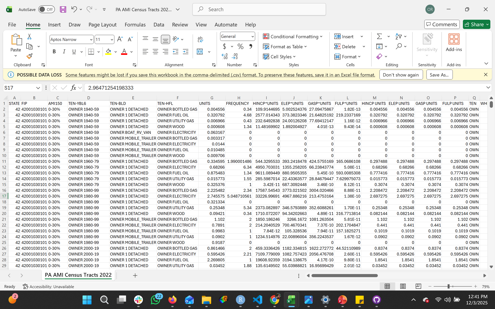

Annual Energy Burden Estimator Dashboard

A web tool to help Philadelphia residents estimate their annual home energy burden based on location, housing type, and income category.

Live Site

https://oindriza.github.io/Energyburdenestimator_dashboard-project/

Overview

Energy burden represents the percentage of household income spent on home energy bills. Spending over 6% of income on energy is considered a high energy burden, and spending over 10% is a severe burden.

This dashboard helps Philadelphia residents:

- Search for an address
- Identify the census tract
- Explore typical energy burden levels across the city
- Estimate their own burden based on housing type and income category
- The app visualizes spatial inequities in energy costs using Leaflet and an ACS-based model.

Features

Interactive Map

- Full-screen Leaflet map
- Colored census tracts reflecting energy burden levels
- Click to select a location
- Custom legend + north arrow

Burden Estimator

- Address search with geocoding
- Choose “Housing Type” + “Income Category”
- Returns predicted annual energy burden for that tract

UI/UX Features

- Full-screen hero header
- Fixed sidebar with no scrolling
- Mobile-responsive layout
- Smooth map zoom/pan
- Clean color palette optimized for accessibility

Methodology

This project integrates multiple datasets—including the U.S. Department of Energy’s Low-Income Energy Affordability Data (LEAD) Tool 2022 and ACS 2022 tract-level median household income to estimate and visualize annual energy burden across Philadelphia census tracts. The workflow involved cleaning, filtering, merging, and modeling several datasets to produce a tract-level energy burden lookup table for use in an interactive web dashboard.

1. Data Sources
LEAD Tool 2022 Dataset

The LEAD dataset was downloaded for the state of Pennsylvania. It reports tract-level estimates of:

AMI income categories (e.g., “0–30% AMI”, “30–60% AMI”, “150+”)

Housing type and tenure (e.g., detached, multifamily, mobile home)

Fuel types (electricity, gas, bottled gas, wood, fuel oil)

Estimated annual energy expenditures in unit-weighted format
(ELEP*UNITS, GASP*UNITS, FULP*UNITS)

A portion of the dataset structure is shown in the attached screenshot:

Each tract appears multiple time, once per AMI group and housing type combination with numeric fields reporting estimated annual electricity, gas, and fuel expenditures.

2. Filtering to Philadelphia Census Tracts

From the statewide dataset, we extracted only Philadelphia census tracts by filtering on the tract FIPS prefix 42101:

df_philly <- df %>% mutate(FIP = as.character(FIP)) %>%
  filter(str_starts(FIP, "42101"))

The same filtering was applied to AMI tract-level income data.

3. Constructing Energy Burden Fields

For each tract–income–housing combination, annual energy expenditures were computed by summing all relevant unit-based cost fields:

TotalBurden = `ELEP*UNITS` + `GASP*UNITS` + `FULP*UNITS`

This produced a tract-level energy cost table containing:
- GEOID
- IncomeCategory (AMI group)
- HousingType
- ElectricBurden
- GasBurden
- FuelBurden
- TotalBurden

4. Attaching Census Tract Geometry

To visualize patterns spatially, we merged the burden table with a Philadelphia Census Tracts GeoJSON file. Both datasets were harmonized by converting GEOID fields to character:

philly_merged <- philly_geo %>%
  left_join(dashboard_df, by = "GEOID")

The merged file was exported as GeoJSON for use in the JavaScript/Leaflet dashboard.

5. Creating a Clean Burden Lookup Table

Because each tract appears repeatedly across AMI–housing combinations, numeric inconsistencies were cleaned by:

Converting burden fields to numeric

Aggregating to the median total annual burden for each
(GEOID × IncomeCategory × HousingType) combination:

df_clean <- df %>%
  group_by(GEOID, IncomeCategory, HousingType) %>%
  summarise(MedianBurden = median(TotalBurden, na.rm = TRUE))

This dataset was saved as burden_lookup_clean.csv.

6. Integrating Actual Income Estimates

To convert AMI categories into dollar-denominated household income, we joined two sources:

a. ACS 2022 Median Household Income (tidycensus)

Extracted for all Philadelphia tracts:
philly_income <- get_acs(
  geography = "tract",
  variables = "B19013_001",
  state = "PA",
  county = "Philadelphia",
  year = 2022
)

b. LEAD AMI Categories Converted to Midpoints

AMI percentage ranges (e.g., “0–30%”) were converted into numeric midpoints:
AMI_mid = (lower + upper) / 2

Estimated tract income was then calculated as:
est_income = (AMI_mid / 100) * MedianIncome

7. Computing Energy Burden (% of Income)

Annual energy burden was computed as:
EnergyBurdenPercent =
  round((MedianBurden / est_income) * 100, 2)

This expresses the share of estimated household income spent on electricity, fuel, and gas costs.

8. Creating Income Buckets

Dollar-denominated income buckets were created to support regression modeling and dashboard filtering:
df_merged <- df_merged %>%
  mutate(
    IncomeBucket = case_when(
      MedianIncome < 20000 ~ "Under $20k",
      MedianIncome >= 20000 & MedianIncome < 30000 ~ "$20k–$30k",
      MedianIncome >= 30000 & MedianIncome < 40000 ~ "$30k–$40k",
      MedianIncome >= 40000 & MedianIncome < 50000 ~ "$40k–$50k",
      MedianIncome >= 50000 & MedianIncome < 60000 ~ "$50k–$60k",
      MedianIncome >= 60000 & MedianIncome < 75000 ~ "$60k–$75k",
      MedianIncome >= 75000 & MedianIncome < 100000 ~ "$75k–$100k",
      MedianIncome >= 100000 & MedianIncome < 150000 ~ "$100k–$150k",
      MedianIncome >= 150000 ~ "$150k+",
      TRUE ~ NA
    )
  )

9. Regression Modeling

A linear regression model was estimated to assess whether housing type and income level significantly predict energy burden:

model <- lm(
  EnergyBurdenPercent ~ HousingType + IncomeBucket,
  data = model_df
)

Interpretation of model summary:

Both categorical predictors, IncomeBucket and HousingType showed extremely small p-values (p < 0.001).
This means:

We reject the null hypothesis that housing type and income level have no relationship with energy burden.
The statistical evidence indicates that both variables are significant predictors of tract-level energy burden.

10. Final Dataset for the Dashboard

The final table exported to the JavaScript dashboard contains:
- GEOID
- HousingType
- IncomeBucket
- MedianBurden
- EstimatedIncome
- EnergyBurdenPercent

11. Use of Regression Coefficients in the JavaScript Dashboard

The final step of the methodology involved operationalizing the statistical model inside the interactive web application. After estimating the linear regression model in R—predicting EnergyBurdenPercent using housing type and income bucket—the resulting coefficient estimates were extracted from the model summary and manually inserted into the JavaScript code. These coefficients serve as the underlying parameters for a client-side prediction function. When a user selects an income range and housing type in the dashboard, the app dynamically computes the predicted energy burden by applying the regression equation directly in JavaScript.

Technologies Used

- JavaScript (vanilla)
- Leaflet.js for interactive mapping
- Turf.js for spatial lookup
- CSS3 for layout + design
- GitHub Pages for deployment
- NPM + ESLint + Stylelint for code quality

Author

Oindriza Reza Nodi
MCP, University of Pennsylvania